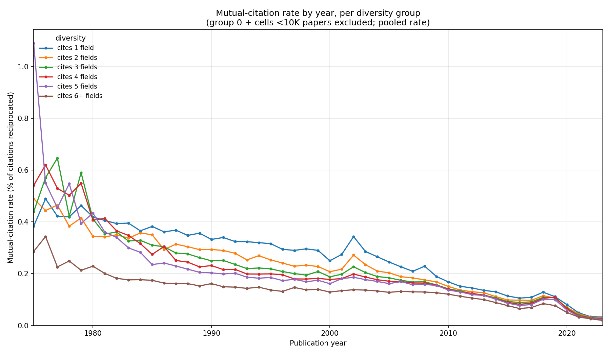
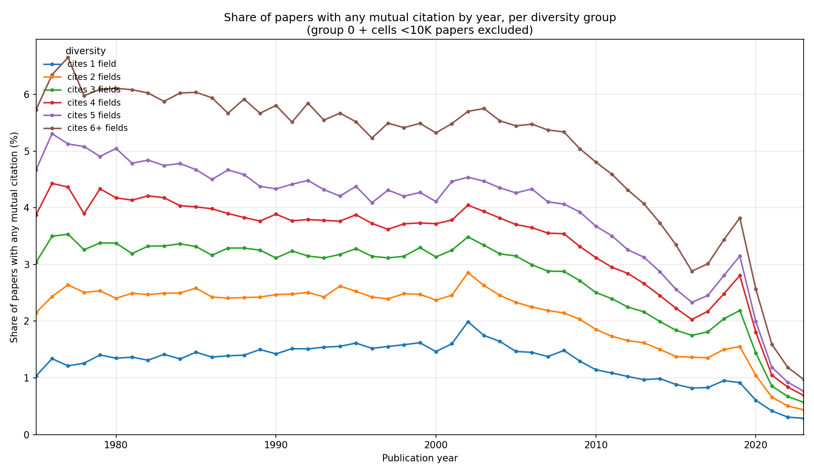

# Mutual Citations & Field Diversity: Graph Summary

## 1. Mutual-citation rate by diversity group

Each individual citation a paper makes is less likely to be returned the more fields that paper cites.

## 2. Share of papers with any mutual citation, by diversity group

More interdisciplinary papers are more likely to receive at least one reciprocated citation. Every diversity group is declining together over time.

## 3. Mean mutual citations vs. mean field diversity over time (1975–2023)

As papers cite more fields over 50 years, the average rate of mutual citation declines.

---

# Without author self-citations

The charts above count **every** mutual citation. The three below repeat the same analyses after removing mutual pairs whose two papers share at least one author — i.e. excluding author self-reciprocity, which accounts for **58% of all mutual pairs**. These isolate genuine reciprocal citation between separate author groups.

## 4. Mutual-citation rate by diversity group — self-citations removed

Even when authors citing themselves are excluded, each citation is still less likely to be returned the more fields a paper cites.

## 5. Share of papers with any mutual citation, by diversity group — self-citations removed

More interdisciplinary papers remain the most likely to receive at least one genuine (non-self) reciprocated citation, and every diversity group still declines together over time.

## 6. Mean mutual citations vs. mean field diversity over time (1975–2023) — self-citations removed

Mutual citation per paper is lower once self-reciprocity is removed, but the trend holds: as papers cite more fields, genuine mutual citation declines.
